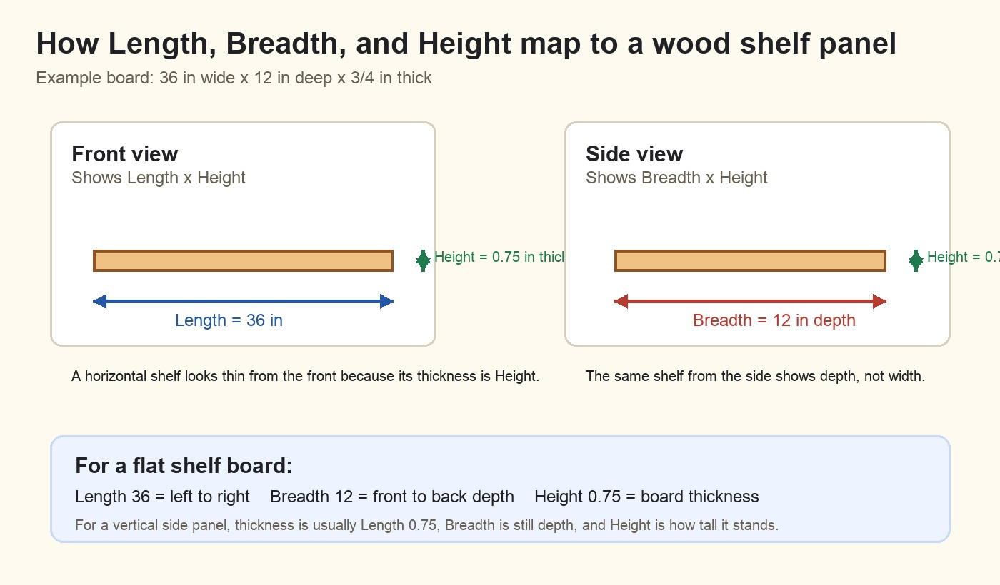

# Beginner Wood Project Modeler User Guide

This tool helps scouts and adult leaders turn a simple wood project idea into a 3D model and a cut list.

Use the tool here:

```text
/Users/paramraghavan/dev/beginners-3d-modelling/drag_drop_wood_modeler.html
```

Recommended way to open it:

```bash
cd /Users/paramraghavan/dev/beginners-3d-modelling
python3 -m http.server 8766
```

Then open:

```text
http://127.0.0.1:8766/drag_drop_wood_modeler.html
```

## Start Here

For most projects, do not draw from scratch first.

Use this beginner workflow:

1. Choose a preset from `Model library`.
2. Click `Load model`.
3. Click one board or panel in the part list, 2D drawing, or 3D preview.
4. Change its `Length`, `Breadth`, or `Height`.
5. Click `Apply dimensions`.
6. If the selected part is plywood, use the support buttons:
   - `Add cleats under`
   - `Add sag bar under front`
   - `Add base skids under`
7. Review the cut list.
8. Click `Export 3D HTML` when the model is ready.

Drawing from scratch is useful later, after the user understands how one part is sized and positioned.

## What You See On The Screen

The screen has four main areas.

| Area | What It Is For |
|---|---|
| Top toolbar | Opens this user guide and reminds the user of the main workflow. |
| Left panel | Load models, edit the selected part, add supports, review parts, and export. |
| Middle panel | 2D front and side drawings. Use these to see Length, Breadth, and Height. |
| Right panel | Live 3D preview with floor, wall, top guide, and X/Y/Z axis cues. |

## The Most Important Idea

Every wood piece is a rectangular part.



| Field | Meaning | Easy Way To Think About It |
|---|---|---|
| `Length` | Left-to-right size | How wide the board looks from the front |
| `Breadth` | Front-to-back depth | How deep the board goes into the project |
| `Height` | Bottom-to-top size | How tall or thick the part is |
| `X left` | Left position | Where the part starts from the left |
| `Z back` | Depth position | Where the part starts front-to-back |
| `Y bottom` | Bottom position | How high the part starts above the floor |

All measurements are in inches.

For a flat shelf board, thickness is usually `Height`, not `Breadth`.

Example:

```text
Length: 36
Breadth: 12
Height: 0.75
```

This means the shelf is 36 inches wide, 12 inches deep, and 3/4 inch thick.

For a vertical side panel, thickness is often `Length`.

Example:

```text
Length: 0.75
Breadth: 12
Height: 24
```

This means the side panel is 3/4 inch thick, 12 inches deep, and 24 inches tall.

## How The 2D Views Work

The tool has two 2D views because a wood project has both width and depth.

| View | Shows | Use It For |
|---|---|---|
| `Front view` | `Length x Height` | Shelves, sides, table legs, fronts, dividers |
| `Side view` | `Breadth x Height` | Depth, side panels, how far shelves run front-to-back |

When you draw in `Front view`, the new part uses the rectangle for `Length x Height`. It starts with the default `Breadth` value shown above the drawing area. Select the part and set `Breadth` to the real front-to-back depth.

Example for a shelf panel:

```text
Draw in Front view: 36 wide x 0.75 high
Then set Breadth: 12
Final part: 36 Length x 12 Breadth x 0.75 Height
```

When you draw in `Side view`, the new part uses the side drawing for `Breadth x Height`. Then set `Length` in the selected part editor.

Example for a side panel:

```text
Draw in Side view: 12 deep x 24 high
Then set Length: 0.75
Final part: 0.75 Length x 12 Breadth x 24 Height
```

## How The 3D View Works

The 3D preview helps check whether the project makes physical sense.

| Cue | Meaning |
|---|---|
| Red X | Length, left-to-right |
| Green Y | Height, floor-to-top |
| Blue Z | Breadth, front-to-back |
| Tan plane | Floor or ground |
| Blue wall planes | Side/back wall reference |
| Yellow top guide | Project top or ceiling clearance |

If a part touches the tan floor plane, it is sitting on the ground. For cubbies, shelves, and boxes with skids, usually only the skids should touch the floor.

To move the 3D view:

| Action | Mouse Or Trackpad |
|---|---|
| Rotate | Drag inside the 3D preview |
| Zoom | Scroll wheel or trackpad scroll |
| Pan | Right-drag, or two-finger drag on some trackpads |

Rotating the view does not change the wood model. It only changes the camera angle so you can inspect the front, side, back, top, and underside.

## Example 1: Customize An Existing Model

Goal: load `Storage cubbies`, make it wider, add a second divider, and check the floor skids.

### Step A: Load The Model

1. In `Model library`, choose `Storage cubbies`.
2. Click `Load model`.
3. Look at the 3D preview.
4. Confirm the brown base skids touch the floor.
5. Confirm the bottom plywood panel sits above the skids.

### Step B: Make The Cubbies Wider

Select `Top panel`.

Set:

```text
Length: 60
Breadth: 15
Height: 0.75
X left: 0
Z back: 0
Y bottom: 35.25
```

Click `Apply dimensions`.

Select `Bottom panel`.

Set:

```text
Length: 60
Breadth: 15
Height: 0.75
X left: 0
Z back: 0
Y bottom: 1.5
```

Click `Apply dimensions`.

Select `Middle horizontal shelf`.

Set:

```text
Length: 60
```

Click `Apply dimensions`.

### Step C: Move The Right Side To The New Edge

Select `Right side`.

Set:

```text
X left: 59.25
Y bottom: 2.25
```

Click `Apply dimensions`.

### Step D: Add A Second Divider

Select `Center vertical divider`.

Click `Duplicate`.

Rename the copy:

```text
Second vertical divider
```

Set:

```text
X left: 40
Y bottom: 2.25
```

Click `Apply dimensions`.

### Step E: Fix Back And Skids

Select `Back panel`.

Set:

```text
Length: 60
```

Click `Apply dimensions`.

Select `Base skid right`.

Set:

```text
X left: 54.5
Y bottom: 0
```

Click `Apply dimensions`.

### Step F: Add Support

Select `Bottom panel`.

Click `Add sag bar under front` if the widened bottom panel needs more support.

Review the cut list. It should show the wider panels and the new divider.

Check these values before building:

| Part Type | Correct Floor Position |
|---|---|
| Base skids | `Y bottom: 0` |
| Bottom plywood | `Y bottom: 1.5` |
| Side panels and dividers | `Y bottom: 2.25` |

## Example 2: Build A Simple Shelf From Scratch

Goal: make a simple 36 inch wide, 12 inch deep, 12 inch tall tabletop shelf.

### Step A: Start Blank

1. Click `Start blank`.
2. Click `Draw board`.
3. Click `Front view`.

### Step B: Draw The Bottom Panel

Draw a long rectangle near the bottom.

Select the new part and set:

```text
Name: Bottom panel
Length: 36
Breadth: 12
Height: 0.75
X left: 0
Z back: 0
Y bottom: 0
Material: Plywood
```

Click `Apply dimensions`.

The part may look thin in 3D until `Breadth` is set to `12`.

### Step C: Create The Top Panel

Click `Duplicate`.

Set:

```text
Name: Top panel
Length: 36
Breadth: 12
Height: 0.75
X left: 0
Z back: 0
Y bottom: 12
Material: Plywood
```

Click `Apply dimensions`.

### Step D: Create The Left Side

Select `Bottom panel`.

Click `Duplicate`.

Set:

```text
Name: Left side panel
Length: 0.75
Breadth: 12
Height: 12
X left: 0
Z back: 0
Y bottom: 0.75
Material: Plywood
```

Click `Apply dimensions`.

### Step E: Create The Right Side

Click `Duplicate`.

Set:

```text
Name: Right side panel
Length: 0.75
Breadth: 12
Height: 12
X left: 35.25
Z back: 0
Y bottom: 0.75
Material: Plywood
```

Click `Apply dimensions`.

### Step F: Add Supports

Select `Bottom panel` or `Top panel`.

Use one of these:

| Button | When To Use |
|---|---|
| `Add cleats under` | To support plywood along the left and right edges |
| `Add sag bar under front` | To stiffen a long shelf edge |
| `Add base skids under` | To keep a floor shelf or cubby off the ground |

For a tabletop shelf, skids may not be needed. For a floor shelf, add skids under the bottom panel.

### Step G: Check The Model

1. Click `Front view`.
2. Confirm the shelf is 36 inches wide and 12 inches tall.
3. Click `Side view`.
4. Confirm the shelf is 12 inches deep.
5. Look at the 3D view.
6. Confirm the sides stand on the bottom panel and the top sits above the sides.
7. Review the cut list.
8. Click `Export 3D HTML`.

## One-Click Supports

The support buttons work only when the selected part looks like a plywood shelf, top, bottom, deck, or panel.

| Button | What It Adds |
|---|---|
| `Add cleats under` | Two narrow cleats under the plywood edges |
| `Add sag bar under front` | A stiff front bar to reduce sag |
| `Add base skids under` | Three base skids under a bottom panel |

If the buttons are disabled, select a plywood shelf/top/bottom/panel first.

## Common Beginner Checks

Before cutting wood, check these items:

1. Are all measurements in inches?
2. Does every shelf or panel have the correct `Breadth`?
3. Are floor skids at `Y bottom: 0`?
4. Are bottom panels above the skids?
5. Do long shelves have a sag bar or cleats?
6. Do tall legs have aprons or stretchers connecting them?
7. Does the cut list include every real piece you need to cut?

This tool is a planning aid. Review the final design with an adult woodworker before buying lumber or cutting parts.
